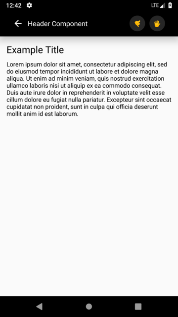

# react-native-custom-header
A simple header for React Native apps.




## Installation
```
npm install --save react-native-custom-header
```

## Documentation
| Prop  | Description  | Type  | Default  | Required  |
|---|---|---|---|---|
| backgroundColor | Background color of header. | string | 'black' | **NO** |
| width | Set open state function. | number | Dimensions.get('window').width | **NO** |
| height | Title of select picker modal. | number | 60 | **NO** |
| headerStyle | Custom style for title. | object | null | **NO** |
| isBack | Showing state of back button. | boolean | false | **NO** |
| backIconColor | Icon icon's color. | string | - | **NO** |
| backButtonStyle | Icon color's style. | object | - | **NO** |
| backButtonComponent | Custom back button component. If you're using that, backIconColor, backButtonStyle is useless. | any | - | **NO** |
| isGradient | Gradient color state of header. | boolean | false | **NO** |
| colors | Gradient colors. | array | ['#6a11cb', '#2575fc'] | **NO** |
| start | Gradient start locations. | object | {x: 0, y: 0} | **NO** |
| end | Gradient end locations. | object | {x: 1, y: 0} | **NO** |
| locations | Colors locations. (The length of this array must be the same as the length of the array of colors.) | array | [0, 1] | **NO**  |
| title | Header title. | string | 'Header Component' | **NO** |
| titleStyle | Custom header title style. | object | null | **NO** |
| titleComponent | Custom title component. If you're using that, titleStyle is useless. | any | null | **NO** |
| rightButtons | Buttons on the right side of the header. | array | null | **NO** |
| isShowShadow | Show state of shadow. | boolean | false | **NO** |
| shadowColor | Shadow's color. | string | 'black' | **NO** |
| shadowSize | Shadow's size. (iOS) | number | 2 | **NO** |
| elevation | Elevation size. (Shadow size) (Android) | number | 20 | **NO** |
| isTranslucentStatusBar | Status Bar's translucent state. | boolean | true | **NO** |
| statusBarColor | Status Bar's background color. | string | true | **NO** |
| statusBarStyle | Status Bar's style. ('light-content', 'dark-content') | string | true | **NO** |

Props table for rightButtons array:

| Prop | Description | Type | Default | Required |
|---|---|---|---|---|
| id | Button ID. | number | -  | **YES** |
| color | Button background color.| string | - | **YES** |
| content | Button content. | any | -  | **YES** |
| action | Button action. | function | -  | **YES** |

## Usage
```
<View style={{flex: 1}}>

    // Header Component
    <Header
        isGradient={true}
        colors={['#6a11cb', '#2575fc']}
        isBack={true}
        title="Header Component Title Here"
        rightButtons={rightButtons}
        height={60}
        isShowShadow={true}
    />
    
    // Page Content
    <View style={{padding: 15}}>
        <Text
            style={{fontSize: 22, fontWeight: '500', marginBottom: 10,}}
        >
            Example Title
        </Text>

        <Text>
            Lorem ipsum dolor sit amet, consectetur adipiscing elit, sed do eiusmod tempor incididunt ut labore
            et dolore magna aliqua. Ut enim ad minim veniam, quis nostrud exercitation ullamco laboris nisi ut
            aliquip ex ea commodo consequat. Duis aute irure dolor in reprehenderit in voluptate velit esse
            cillum dolore eu fugiat nulla pariatur. Excepteur sint occaecat cupidatat non proident, sunt in
            culpa qui officia deserunt mollit anim id est laborum.
        </Text>
    </View>
</View>
```
